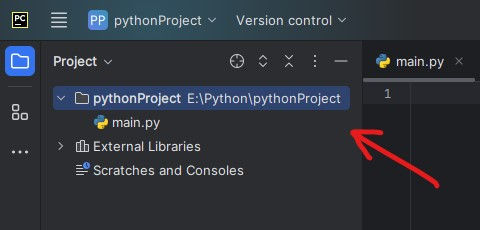
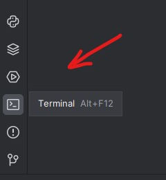
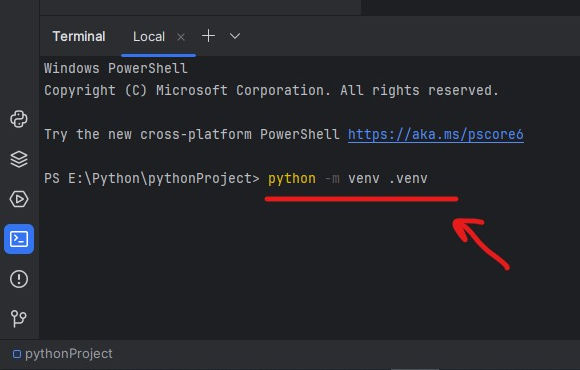
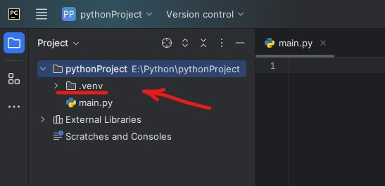
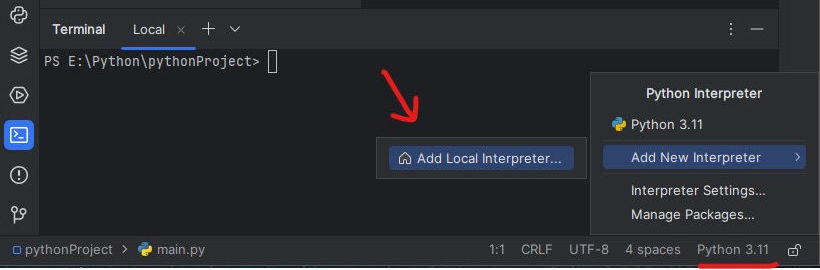
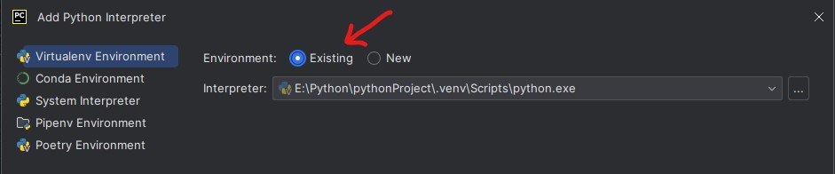
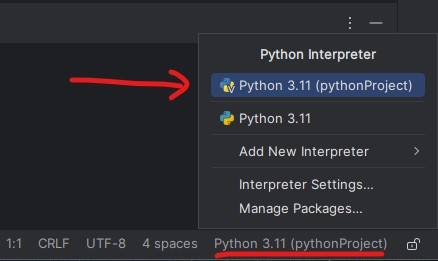
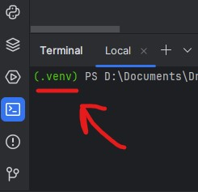

## Virtual Environments

[Створення віртуальних середовищ](https://docs.python.org/3.10/library/venv.html)

__Увага!__

Налаштування в програмі __Pycharm__
 
Якщо ваш проект створений але в ньому 
не лаштовано віртуальне середовище

---

1. Відкрийте проект в якому хочете налаштувати віртуальне середовище

    

2. Відкрийте вікно терміналу

    

3. В терміналі виконайте коменду:

    Windows
    
    > python -m venv . venv
     
    Linux
    
    > python3 -m venv . venv
     
    

    Після виконання команди у вашому проекті має зявитися папка __.venv__
    
    

4. Змініть поточний інтерпритатор

    
    
    У вікні яке відкриється виберіть середовище _"існуючий"_
    
    

5. Активуйте віртуальне середовише, і __перезавантажте__ програму   

    
    
    Після перезапуску програми у терміналі буде вказано 
    що ви працюєте у віртуальному середовищі
    
    
