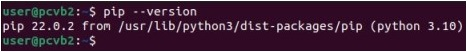
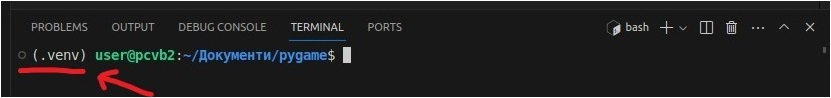
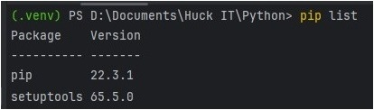

# Заняття 9

---

### Модуль Pygame

__Pygame__ набір кросплатформенних модулів для мови програмування Python, 
створений для розробки відеоігор. Включає в себе бібліотеки 
комп'ютерної графіки і звуку на базі SDL.

Вебсайт: [pygame.org](https://www.pygame.org/news)

---

### 1. 
Перед встановленням Pygame перевірте чи у вас є система керування пакунками. 

__PIP__ — система керування пакунками, яка використовується для встановлення 
та управління програмними пакетами, які написані на Python. 
Багато пакетів можна знайти в [Python Package Index](https://pypi.org/) (PyPI).

Перевірити версію pip можна командою: 

```
pip --version  
```

Якщо PIP встановлено то дана команда вам виведе версію програми:  



### 2. 

Переконайтеся що ви використовуєте віртуальне середовище.
В терміналі на початку рядка має бути написано: __(.venv)__



Якщо віртуальне середовища не налаштовано, 
то налаштуйте: __[інструкція](../p07/virtual_environments.md)__  

### 3. 

Встановлення модуля __Pygame__ 

За допомогою команди __pip list__, перевірте модулі які встановлено у віртуальному середовищі: 

```
pip list
```



Якщо моуль Pygame відсутній, то його треба __[встановити](https://pypi.org/project/pygame/)__.

```
pip install pygame 
```

Якщо після цього виконати команду __pip list__, то в списку модулів буде пристутній pygame


### Event

Події, які надходять із системи, матимуть гарантований набір атрибутів залежно від типу. 
Нижче наведено список типів подій з їх конкретними атрибутами

```hs
- QUIT              none
- ACTIVEEVENT       gain, state
- KEYDOWN           key, mod, unicode, scancode
- KEYUP             key, mod, unicode, scancode
- MOUSEMOTION       pos, rel, buttons, touch
- MOUSEBUTTONUP     pos, button, touch
- MOUSEBUTTONDOWN   pos, button, touch
- JOYAXISMOTION     joy (deprecated), instance_id, axis, value
- JOYBALLMOTION     joy (deprecated), instance_id, ball, rel
- JOYHATMOTION      joy (deprecated), instance_id, hat, value
- JOYBUTTONUP       joy (deprecated), instance_id, button
- JOYBUTTONDOWN     joy (deprecated), instance_id, button
- VIDEORESIZE       size, w, h
- VIDEOEXPOSE       none
- USEREVENT         code
```

---

### Iгрові рушії

Ігрові рушії — це інструменти, 
доступні для реалізації відеоігор, не будуючи все з нуля. 
Незалежно від того, базуються вони на 2D чи 3D, вони пропонують інструменти, 
які допоможуть створити та розмістити програми.

[Game engine](https://en.wikipedia.org/wiki/List_of_game_engines): Unreal, Unity, Godot ...